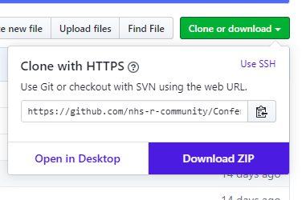

# NHS-R Community Conference Workshops 2020 

This repository holds the content for the NHS-R Community conference, November 2020.

Plenary session and lightning talk material will be shared in the relevant folders, and workshop details are below.

 

---

# Workshops

The conference programme includes several workshop session.  Please make sure you are aware of the session you are attending and have the considered how you will access the material (see below).  Workshops will begin promptly and presenters will assume you can access the relevant material.

## Workshop sessions

### Day1

TBC

### Day 2

TBC

  

### For workshop attendees:

There are two ways to access the workshops:

+ Using the RStudio Cloud Workspace __(Our prefered option)__: All material is available in the conference workspace:  https://bit.ly/2Nnblc2 .  This works from your web browser, and you do not need R and Rstudio installd on your machine to access it.

+ Using your own machine: You can download zip files of each workshop, or if you are familiar with Git and GitHub, you can clone the repository.  Follow the links in the table above to the relevant workshops.

If you are unsure about your setup, or unable to access the material on your own machine, please use the RStudio Cloud method.

 

__To download and use this material on you machine, please use these steps:__

1. Make sure you have `R` and RStudio installed.

1. Identify the sessions you are attending from the list above, and follow the link to the relevant repository.
1. Click the 'Clone or Download' button and select 'Download zip file':

1. Once the file has downloaded, unzip it, and open the '.Rproj' file.

  

### For workshop leaders:

Please commit you workshop material to a GitHub repository by the date requested.  This will allow us time to make sure your material is available on RStudio cloud.  Please email a link to your repository, and a list of the required `R` packages, to [nhsrconfspeakers@gmail.com](mailto:nhsrconfspeakers@gmail).

If you are using healthcare related datasets as examples, please consider adding them to the `NHSRdatasets` package.  The data can then be reused by other to learn `R` or when running training.
You can find the package at: https://github.com/nhs-r-community/NHSRdatasets

 

__Please note that the 'Conference_2020' project is released with a
[Contributor Code of Conduct](CODE_OF_CONDUCT.md).
By contributing to this project, you agree to abide by its terms.__

